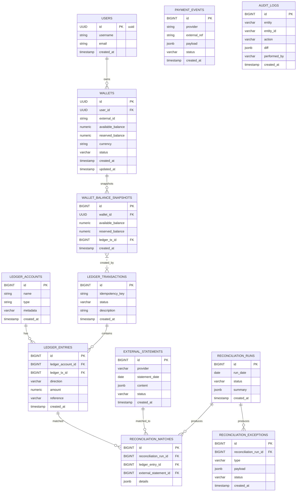

# ERD & Detailed Implementation Plan

Date: 2026-05-13

## Goals
This document contains:
- A Mermaid ERD describing the main tables of the Wallet + Ledger + Reconciliation system.
- Per-table descriptions: primary keys, foreign keys, indexes, and key data types.
- A detailed plan of functions / APIs / services / background jobs to implement, with priority, I/O, side effects, transactional boundaries, and acceptance criteria.

---

## ER Diagram (Mermaid)

> **Implementation notes (for AI assistants):**
> * Primary entities (`users`, `wallets`) use `UUID` IDs.
> * Ledger tables (`ledger_*`, `reconciliation_*`) use `BIGINT` identity columns to guarantee monotonic ordering on queries.
> * Money columns (`amount`, `*_balance`) MUST be `NUMERIC(19,4)` in PostgreSQL and `java.math.BigDecimal` in Java. Never use `float`/`double`.
> * Free-form payloads (`payload`, `content`, `summary`) use PostgreSQL `JSONB` for indexability.
> * The diagram is a logical model; physical table names follow `snake_case` in migrations.

---

## Core Concepts

1. **Double-Entry Bookkeeping.** Every transaction has ≥ 2 entries that sum to zero per currency. Money never appears or disappears — it moves between accounts (e.g. from a settlement asset account to a wallet liability account).
2. **Idempotency.** Prevents duplicated debits/credits from retried webhooks or flaky networks. Implemented via a UNIQUE `idempotency_key` column.
3. **Concurrency Control.** Pessimistic row locks (`SELECT ... FOR UPDATE`) on wallets prevent race conditions on balance updates.
4. **Reconciliation.** A scheduled job compares ledger entries against external bank statements and surfaces unmatched items as exceptions.

---

## Technology Stack

* **Backend:** Java 21, Quarkus, Hibernate ORM with Panache, RESTEasy Reactive, Hibernate Validator, Flyway, SmallRye OpenAPI / Health.
* **Frontend:** React 18, TypeScript, Vite, Tailwind CSS, TanStack Query.
* **Database:** PostgreSQL 15 (ACID, JSONB, row-level locking).
* **Testing:** JUnit 5, Mockito, Testcontainers (mandatory for any concurrency-sensitive code).

---

## Implementation Plan

### Phase A — MVP / Core Ledger flows (high priority)

1. **`POST /api/v1/wallets/top-up`**
   - Input: `{ walletId, amount, currency, idempotencyKey, externalRef? }`
   - Service: `WalletService.topUp(request)`
   - Steps: lock wallet (`SELECT ... FOR UPDATE`) → insert `ledger_transactions` + two `ledger_entries` (DEBIT settlement, CREDIT wallet liability) → bump `wallets.available_balance` → insert `wallet_balance_snapshots`.
   - AC: calling with the same `idempotencyKey` twice does not change balance; snapshot count increases by exactly one per unique call.

2. **`POST /api/v1/wallets/transfer`**
   - Input: `{ fromWalletId, toWalletId, amount, currency, idempotencyKey }`
   - Concurrency: lock wallets in ascending UUID order to prevent deadlock.
   - AC: source debited, target credited atomically; full rollback if source has insufficient balance.

3. **`POST /api/v1/ledger/reversal`**
   - Input: `{ ledgerTransactionId, reason, idempotencyKey }`
   - Behavior: create a new transaction whose entries mirror the directions of the original. `ledger_entries` remains append-only.

### Phase B — Integrations & idempotency hardening

1. **Webhook inbox: `POST /api/v1/payment/webhook`**
   - Persist the raw payload to `payment_events` (JSONB) and return `200 OK` immediately.
   - A `@Scheduled` worker processes pending events with idempotent semantics, advancing them through `PENDING → PROCESSED | FAILED`.

### Phase C — Reconciliation engine & jobs

1. **`ReconciliationRunner` (scheduled)**
   - Pull rows from `external_statements`.
   - Match against `ledger_entries` by `(amount, date, reference)`.
   - Write matches to `reconciliation_matches`; unmatched go to `reconciliation_exceptions` for manual review.

---

## Execution Roadmap (80/20)

**Sprint 1 (Weeks 1–2): Core Ledger APIs & UI skeleton.** Quarkus + Flyway + Postgres set up. Top-up + transfer endpoints. React shell with sidebar + main panel; laptop-first density from day one.

**Sprint 2 (Weeks 3–4): Resilience, security, transaction history.** Pessimistic locking + Testcontainers concurrency tests. OWASP pass: input validation, BOLA checks, no SQL injection. Transaction history table on the frontend.

**Sprint 3 (Weeks 5–6): Reconciliation engine & admin workspace.** CSV upload endpoint, matching algorithm, exception queue. Admin screen with side-by-side compare (ledger vs. statement).

**Sprint 4 (Weeks 7–8): Background jobs, AI tooling, DevOps.** Webhook inbox pattern. Husky pre-push hooks plus AI-assisted review (Claude Code / Copilot). README polish.
